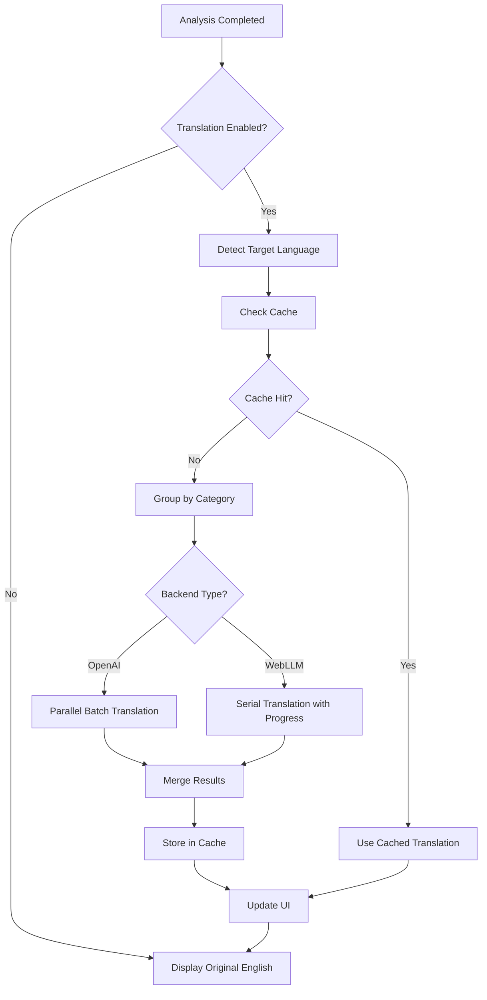
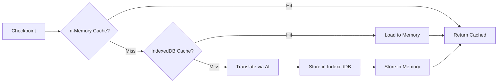
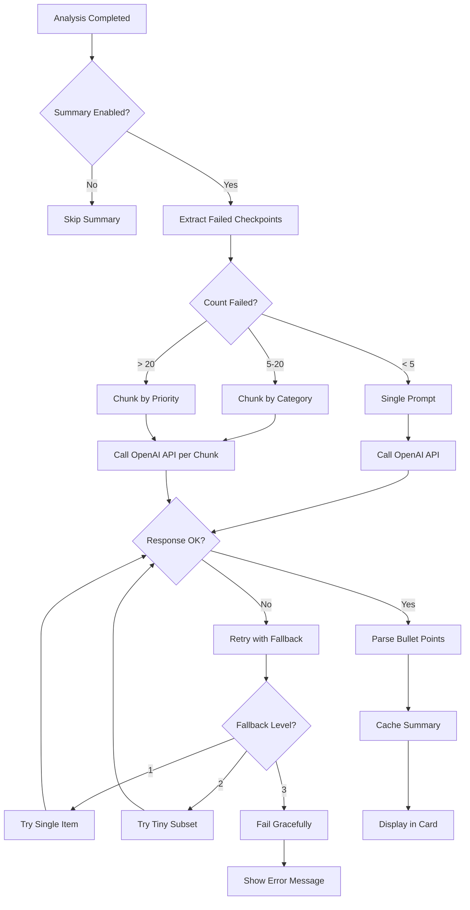
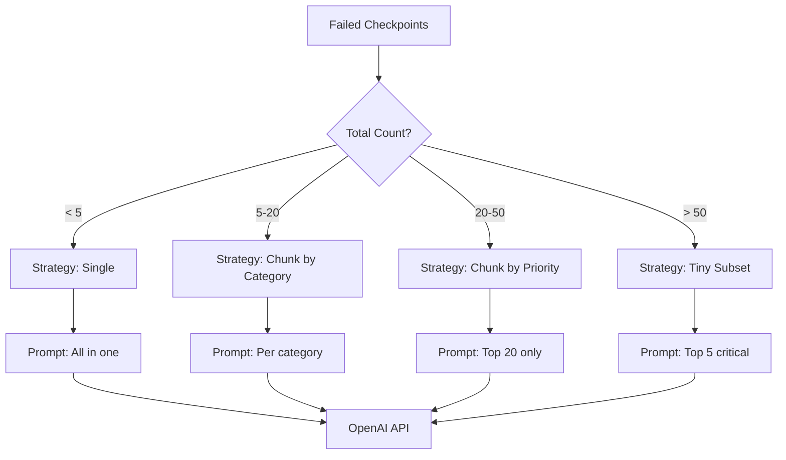

# AI Features Guide

The Crownpeak DQM React Component includes powerful AI-driven features to enhance the analysis experience through **automatic translation** and **intelligent summaries**.

## Table of Contents

- [Overview](#overview)
- [Features Comparison](#features-comparison)
- [AI Translation](#ai-translation)
  - [Translation Flow](#translation-flow)
  - [OpenAI Backend](#openai-backend)
  - [WebLLM Local Backend](#webllm-local-backend)
  - [Translation Modes](#translation-modes)
  - [Caching Strategy](#caching-strategy)
- [AI Summary](#ai-summary)
  - [Summary Generation Flow](#summary-generation-flow)
  - [Chunking Strategy](#chunking-strategy)
- [Configuration](#configuration)
- [localStorage Keys](#localstorage-keys)
- [Performance Comparison](#performance-comparison)
- [Troubleshooting](#troubleshooting)

---

## Overview

The AI features provide two main capabilities:

1. **🌐 Translation**: Automatically translate DQM analysis results (checkpoints, categories, topics) into the user's preferred language
2. **📝 Summary**: Generate AI-powered bullet-point summaries of the most critical quality issues

Both features can run with **OpenAI** (cloud-based) or **WebLLM** (local, browser-based).

---

## Features Comparison

| Feature | OpenAI Backend | WebLLM Local Backend |
|---------|----------------|----------------------|
| **Translation** | ✅ Supported | ✅ Supported |
| **Summary** | ✅ Supported | ❌ Not Supported (OpenAI only) |
| **Speed** | ⚡ Fast (~2-5s) | 🐌 Slower (~10-30s) |
| **Privacy** | ☁️ Cloud API | 🔒 100% Local |
| **Cost** | 💰 Pay per API call | 🆓 Free |
| **Internet Required** | ✅ Yes | ❌ No (after model download) |
| **Browser Support** | All modern browsers | Chrome 113+, Edge 113+ (WebGPU) |
| **Model Download** | None | 100MB-1GB (one-time) |
| **Concurrent Requests** | ✅ Parallel (3 batches) | ❌ Serial (one at a time) |

**Recommendation**: 
- **Production**: Use OpenAI for best user experience
- **Privacy-focused**: Use WebLLM for sensitive data
- **Development**: Use WebLLM to avoid API costs

---

## AI Translation

### Translation Flow



**Key Steps**:
1. **Analysis Completed**: DQM API returns English results
2. **Target Language Detection**: From i18n context (`en`, `de`, `es`)
3. **Cache Check**: IndexedDB lookup by checkpoint hash
4. **Backend Selection**: OpenAI (parallel) vs WebLLM (serial)
5. **Translation**: Batch processing with progress tracking
6. **Cache Storage**: Persist to IndexedDB for future use
7. **UI Update**: Replace English text with translations

### OpenAI Backend

**Models Supported**:
- `gpt-4o-mini` (Recommended, fast & cheap)
- `gpt-4o` (Higher quality)
- `gpt-4.1-mini`
- `gpt-4.1`

**Setup**:

```typescript
import { DQMSidebar } from '@crownpeak/dqm-react-component';

function App() {
  return (
    <DQMSidebar
      open={true}
      onClose={() => {}}
      onOpen={() => {}}
      config={{
        apiKey: 'your-dqm-api-key',
        websiteId: 'your-website-id',
        translation: {
          enabledByDefault: true,
          modelId: 'gpt-4o-mini',
          computeBudgetMs: 15000, // 15 seconds timeout
        },
      }}
    />
  );
}
```

**API Key Configuration**:

```typescript
// Option 1: Via localStorage (before component mount)
localStorage.setItem('dqm_openai_apiKey', 'sk-...');
localStorage.setItem('dqm_ai_backend', 'openai');

// Option 2: Via AISettingsDialog component (user enters key in UI)
// Users can configure via settings modal
```

**Environment Variables** (for build-time injection):

```bash
# .env.local
VITE_OPENAI_API_KEY=sk-...
VITE_OPENAI_BASE_URL=https://api.openai.com/v1  # Optional, for custom endpoints
```

**Features**:
- ✅ JSON Mode with structured output (type-safe responses)
- ✅ Parallel batch translation (3 concurrent requests, 12 items per batch)
- ✅ Fast mode (~5s) and Full mode (~30s)
- ✅ Automatic retry with exponential backoff
- ✅ Rate limit handling (429 errors)

### WebLLM Local Backend

**Models Available** (Presets):

| Preset | Model | Size | Context Window | Speed |
|--------|-------|------|----------------|-------|
| `tiny` | SmolLM2-360M | ~200 MB | 900 tokens | ⚡⚡⚡ Fast |
| `small` | Llama-3.2-1B | ~700 MB | 1800 tokens | ⚡⚡ Medium |
| `medium` | Llama-3.2-3B | ~2 GB | 1800 tokens | ⚡ Slower |
| `large` | Phi-3.5-mini | ~2.5 GB | 3500 tokens | 🐌 Slow |

**Setup**:

```typescript
import { DQMSidebar } from '@crownpeak/dqm-react-component';

function App() {
  return (
    <DQMSidebar
      open={true}
      onClose={() => {}}
      onOpen={() => {}}
      config={{
        apiKey: 'your-dqm-api-key',
        websiteId: 'your-website-id',
        translation: {
          enabledByDefault: true,
          modelId: 'small', // Preset: tiny, small, medium, large
        },
      }}
    />
  );
}
```

**localStorage Configuration**:

```typescript
localStorage.setItem('dqm_ai_backend', 'local');
localStorage.setItem('dqm_ai_model_preset', 'small'); // tiny, small, medium, large
localStorage.setItem('dqm_translate_results_enabled', 'true');
```

**Browser Requirements**:
- **Chrome 113+** or **Edge 113+** (WebGPU support required)
- **GPU**: Any modern GPU (integrated or dedicated)
- **RAM**: 4GB minimum, 8GB recommended
- ❌ **Not supported**: Firefox, Safari (no WebGPU yet)

**Check WebGPU Support**:

```typescript
const hasWebGPU = 'gpu' in navigator;
console.log('WebGPU supported:', hasWebGPU);
```

**Model Download**:
- First-time use: Downloads model to IndexedDB (~200MB-2GB)
- Progress tracking: `0-100%` displayed in UI
- Fallback to Cache API if IndexedDB quota exceeded
- Models cached permanently (until cleared)

**Features**:
- ✅ 100% client-side, no API calls
- ✅ Works offline (after model download)
- ✅ Privacy-preserving (data never leaves browser)
- ✅ WebGPU-accelerated inference
- ⚠️ Serial execution (one checkpoint at a time)
- ⚠️ Context window limits (truncation for long text)

### Translation Modes

#### Fast Mode (Default)
- **Timeout**: 15 seconds (configurable via `computeBudgetMs`)
- **Behavior**: Partial results allowed
- **Use Case**: Quick translations, user doesn't want to wait
- **Result**: Most checkpoints translated, some may be skipped

```typescript
translation: {
  enabledByDefault: true,
  computeBudgetMs: 15000, // 15s
}
```

#### Full Mode
- **Timeout**: 120 seconds
- **Behavior**: Translate all checkpoints or fail
- **Use Case**: Comprehensive translations, accuracy > speed
- **Result**: All checkpoints translated or error shown

```typescript
translation: {
  enabledByDefault: true,
  computeBudgetMs: 120000, // 120s
}
```

**User Control**:
Users can switch between modes via the AI Settings dialog:
- Fast Mode: ⚡ Quick Translation (partial results OK)
- Full Mode: 🎯 Complete Translation (all or nothing)

### Caching Strategy



**Cache Layers**:

1. **In-Memory Cache** (Fastest)
   - Lifetime: Current session only
   - Scope: Per `assetId`
   - Storage: Redux store (`translatedData`)
   - Cleared: On page reload or logout

2. **IndexedDB Cache** (Persistent)
   - Database: `DQMTranslationCache`
   - Stores:
     - `checkpoints`: Translated checkpoint objects (key: `${hash}-${lang}`)
     - `labels`: Category/Topic labels (key: `label-${text}-${lang}`)
   - Hash Algorithm: FNV-1a (fast, deterministic)
   - Lifetime: Permanent (until manually cleared)
   - Size: ~10MB typical, can grow to 50MB+

**Cache Key Format**:
```typescript
// Checkpoint cache key
`${fnv1aHash(checkpoint.topic + checkpoint.description)}-${targetLanguage}`
// Example: "a1b2c3d4-de"

// Label cache key
`label-${originalText}-${targetLanguage}`
// Example: "label-Performance-de"
```

**Cache Management**:

```typescript
// Clear all translation cache
localStorage.removeItem('dqm_translation_cache_checkpoints');
localStorage.removeItem('dqm_translation_cache_labels');

// Or via IndexedDB API
indexedDB.deleteDatabase('DQMTranslationCache');
```

**Deduplication**:
- Identical checkpoints (same hash) across multiple analyses → translated once, reused
- Reduces API calls and improves speed
- Example: "Image missing alt attribute" appears in 10 analyses → cached once

---

## AI Summary

### Summary Generation Flow



**Key Steps**:
1. **Extract Failed Checkpoints**: Filter to `checkpoint.failed === true`
2. **Count & Chunk**: Divide into manageable chunks (5-20 per chunk)
3. **OpenAI API Call**: Use `gpt-4o-mini` with JSON mode
4. **Retry Logic**: Exponential backoff with fallback strategies
5. **Parse Results**: Extract `<li>` bullet points
6. **Cache**: Store in-memory per `assetId`
7. **Display**: Show in [AISummaryCard](src/components/cards/AISummaryCard.tsx)

### Chunking Strategy



**Chunking Sizes**:
- **Single**: 1-4 checkpoints → One prompt
- **Chunk**: 5-20 checkpoints → Split by category (max 8 per chunk)
- **Tiny**: 20+ checkpoints → Top 5 most critical only
- **Fail**: > 50 checkpoints → Skip summary (too large)

**Prompt Template**:

```typescript
const prompt = `Summarize the following web quality issues in ${targetLanguage}. 
Provide 3-5 bullet points highlighting the most critical problems.
Format each point as an HTML <li> element.

Issues:
${checkpoints.map(cp => `- ${cp.topic}: ${cp.description}`).join('\n')}`;
```

**Response Format** (JSON Mode):

```json
{
  "bullets": [
    "<li>Missing alt text on 23 images impacts accessibility</li>",
    "<li>5 broken links found, affecting user navigation</li>",
    "<li>Performance issues: 3 images exceed 1MB</li>"
  ]
}
```

**Stats Tracking**:

```typescript
interface SummaryStats {
  chunked: boolean;           // Was chunking used?
  chunkCount: number;         // Number of chunks (1-5)
  totalFailed: number;        // Total failed checkpoints
  attempts: number;           // API call attempts (incl. retries)
  emptyResponses: number;     // Empty API responses
  fallbackUsed: 'none' | 'chunk' | 'single' | 'tiny' | 'fail';
  durationMs: number;         // Total generation time
}
```

**Configuration**:

```typescript
summary: {
  enabledByDefault: true,     // Auto-generate after analysis
  timeoutMs: 45000,           // 45 seconds timeout
}
```

**Important**: Summary **always uses OpenAI**, even if translation is set to WebLLM. This is because summary generation requires higher-quality models for coherent bullet points.

---

## Configuration

### DQMConfig Interface

```typescript
interface DQMConfig {
  // ... other config options
  
  /** AI Translation Configuration */
  translation?: {
    /** Enable translation by default */
    enabledByDefault?: boolean;      // Default: false
    
    /** Model ID override (OpenAI: 'gpt-4o-mini', WebLLM: 'small') */
    modelId?: string;                // Default: auto-detected
    
    /** Compute budget in milliseconds (timeout) */
    computeBudgetMs?: number;        // Default: 15000 (Fast mode)
  };
  
  /** AI Summary Configuration */
  summary?: {
    /** Enable summary by default */
    enabledByDefault?: boolean;      // Default: true
    
    /** Summary generation timeout in milliseconds */
    timeoutMs?: number;              // Default: 45000
  };
}
```

**Example: Full AI Configuration**

```typescript
<DQMSidebar
  open={true}
  onClose={() => {}}
  onOpen={() => {}}
  config={{
    apiKey: 'your-dqm-api-key',
    websiteId: 'your-website-id',
    
    // AI Translation (OpenAI)
    translation: {
      enabledByDefault: true,
      modelId: 'gpt-4o-mini',
      computeBudgetMs: 30000,  // 30s for Full mode
    },
    
    // AI Summary
    summary: {
      enabledByDefault: true,
      timeoutMs: 60000,  // 60s for complex analyses
    },
  }}
/>
```

---

## localStorage Keys

The AI features store configuration in `localStorage`:

| Key | Type | Default | Description |
|-----|------|---------|-------------|
| `dqm_translate_results_enabled` | `'true' \| 'false'` | `'false'` | Translation toggle |
| `dqm_translate_results_mode` | `'fast' \| 'full'` | `'fast'` | Translation mode |
| `dqm_ai_backend` | `'openai' \| 'local'` | `'openai'` | Backend selection |
| `dqm_ai_model_preset` | `'tiny' \| 'small' \| 'medium' \| 'large'` | `'small'` | WebLLM model preset |
| `dqm_ai_summary_enabled` | `'true' \| 'false'` | `'true'` | Summary toggle |
| `dqm_openai_apiKey` | `string` | `null` | OpenAI API key |
| `dqm_openai_model` | `string` | `'gpt-4o-mini'` | OpenAI model name |
| `dqm_openai_baseUrl` | `string` | `'https://api.openai.com/v1'` | OpenAI base URL |
| `dqm_translation_persistent_storage` | `'true' \| 'false'` | `'false'` | Persistent storage granted |

**Access Pattern**:

```typescript
import { getLocalStorageItem, setLocalStorageItem } from './utils/localStorage';

// Get translation setting
const translationEnabled = getLocalStorageItem('dqm_translate_results_enabled') === 'true';

// Set OpenAI API key
setLocalStorageItem('dqm_openai_apiKey', 'sk-...');

// Switch to local backend
setLocalStorageItem('dqm_ai_backend', 'local');
setLocalStorageItem('dqm_ai_model_preset', 'small');
```

---

## Performance Comparison

### Translation Speed

| Backend | Checkpoint Count | Time (Fast Mode) | Time (Full Mode) |
|---------|------------------|------------------|------------------|
| **OpenAI (gpt-4o-mini)** | 10 | ~2-3s | ~5-8s |
| **OpenAI (gpt-4o-mini)** | 50 | ~5-8s | ~15-25s |
| **OpenAI (gpt-4o-mini)** | 100 | ~10-15s | ~30-60s |
| **WebLLM (tiny)** | 10 | ~5-10s | ~15-30s |
| **WebLLM (small)** | 10 | ~10-20s | ~30-60s |
| **WebLLM (medium)** | 10 | ~20-40s | ~60-120s |

**Notes**:
- OpenAI times assume good network connection (50ms latency)
- WebLLM times assume GPU available (without GPU: 5-10x slower)
- Cached checkpoints: instant (0ms)

### Summary Speed

| Checkpoint Count | Time (OpenAI) | Fallback Attempts |
|------------------|---------------|-------------------|
| 5 | ~1-2s | 0 (single prompt) |
| 20 | ~3-5s | 0-1 (chunked) |
| 50 | ~8-12s | 1-2 (tiny subset) |
| 100+ | N/A | Fails (too large) |

### Cost Comparison (OpenAI)

Based on `gpt-4o-mini` pricing (~$0.15/1M input tokens, ~$0.60/1M output tokens):

| Operation | Average Tokens | Cost per Call |
|-----------|----------------|---------------|
| Translate 1 checkpoint | ~200 input, ~100 output | ~$0.00009 |
| Translate 50 checkpoints | ~10k input, ~5k output | ~$0.0045 |
| Summary (5 issues) | ~500 input, ~200 output | ~$0.0002 |
| Summary (20 issues) | ~2k input, ~500 output | ~$0.0006 |

**Monthly costs** (assuming 1000 analyses/month with 20 checkpoints each):
- Translation only: ~$4.50/month
- Summary only: ~$0.60/month
- Both: ~$5.10/month

**WebLLM costs**: $0 (free, runs locally)

---

## Troubleshooting

### Translation Not Working

**Problem**: Translation toggle enabled but results still in English

**Solutions**:
1. **Check OpenAI API Key** (if using OpenAI backend):
   ```typescript
   const apiKey = localStorage.getItem('dqm_openai_apiKey');
   console.log('API Key set:', !!apiKey);
   ```
   - Missing key → Add via `AISettingsDialog` or `localStorage.setItem()`
   - Invalid key → Check OpenAI dashboard for correct key

2. **Check Backend Selection**:
   ```typescript
   const backend = localStorage.getItem('dqm_ai_backend');
   console.log('Backend:', backend); // Should be 'openai' or 'local'
   ```

3. **Check Translation Enabled**:
   ```typescript
   const enabled = localStorage.getItem('dqm_translate_results_enabled');
   console.log('Translation enabled:', enabled === 'true');
   ```

4. **Check Console for Errors**:
   ```bash
   # Enable debug logging
   logger.setDebugMode(true);
   ```

### WebLLM Not Loading

**Problem**: "Initializing model..." stuck at 0% or error shown

**Solutions**:

1. **Check WebGPU Support**:
   ```typescript
   if (!('gpu' in navigator)) {
     console.error('WebGPU not supported');
     // Solution: Use Chrome 113+ or Edge 113+
   }
   ```

2. **Check GPU Availability**:
   - Open `chrome://gpu` in Chrome/Edge
   - Look for "WebGPU: Enabled"
   - If disabled: Update graphics drivers

3. **Check Storage Quota**:
   ```typescript
   const estimate = await navigator.storage.estimate();
   console.log('Storage:', estimate.usage, '/', estimate.quota);
   // If quota exceeded: Clear cache or free space
   ```

4. **Clear Model Cache**:
   ```typescript
   // Open DevTools → Application → IndexedDB
   // Delete 'webllm' database
   indexedDB.deleteDatabase('webllm');
   ```

5. **Try Smaller Model**:
   ```typescript
   localStorage.setItem('dqm_ai_model_preset', 'tiny'); // Smallest model
   ```

### Translation Timeout

**Problem**: "Translation timeout" error after 15 seconds

**Solutions**:

1. **Increase Timeout** (Fast → Full mode):
   ```typescript
   translation: {
     computeBudgetMs: 120000, // 2 minutes
   }
   ```

2. **Reduce Checkpoint Count**:
   - Fewer categories → faster translation
   - Or use Fast mode and accept partial results

3. **Switch to OpenAI** (if using WebLLM):
   - WebLLM is slower, OpenAI is ~5x faster

4. **Check Network** (if using OpenAI):
   ```bash
   # Test OpenAI API connectivity
   curl https://api.openai.com/v1/models -H "Authorization: Bearer sk-..."
   ```

### Summary Generation Failed

**Problem**: "Summary generation failed" error

**Solutions**:

1. **Check OpenAI API Quota**:
   - Visit OpenAI dashboard → Usage
   - Error 429 (rate limit) → Wait or upgrade plan
   - Error 401 (invalid key) → Check API key

2. **Check Too Many Checkpoints**:
   - > 50 failed checkpoints may fail
   - Solution: Summary auto-switches to "tiny subset" (top 5)

3. **Increase Timeout**:
   ```typescript
   summary: {
     timeoutMs: 90000, // 90 seconds
   }
   ```

4. **Check Console Logs**:
   ```typescript
   logger.setDebugMode(true);
   // Look for "Summary: failed" messages
   ```

### OpenAI API Errors

| Error Code | Meaning | Solution |
|------------|---------|----------|
| 401 | Invalid API key | Check key in localStorage or OpenAI dashboard |
| 429 | Rate limit exceeded | Wait or upgrade OpenAI plan |
| 500 | OpenAI server error | Retry later, or check OpenAI status page |
| 503 | Service unavailable | Temporary outage, retry in 5 minutes |

### Browser Compatibility Issues

**Problem**: WebLLM not working in Firefox/Safari

**Solution**: WebLLM requires WebGPU, which is only in Chrome/Edge:
- **Chrome 113+**: ✅ Full support
- **Edge 113+**: ✅ Full support
- **Firefox**: ❌ No WebGPU yet (coming soon)
- **Safari**: ❌ No WebGPU yet (experimental only)

**Workaround**: Use OpenAI backend instead, which works in all browsers.

---

## Advanced Topics

### Custom Model Configuration

**OpenAI Custom Model**:

```typescript
translation: {
  modelId: 'gpt-4o',  // Higher quality than gpt-4o-mini
}
```

**WebLLM Custom Model URL**:

```typescript
// Advanced: Load custom GGUF model
localStorage.setItem('dqm_ai_model_url', 'https://example.com/my-model.gguf');
```

### Translation Cache Clearing

**Clear all AI caches**:

```typescript
// Clear translation cache
indexedDB.deleteDatabase('DQMTranslationCache');

// Clear WebLLM model cache
indexedDB.deleteDatabase('webllm');

// Clear localStorage settings
localStorage.removeItem('dqm_translate_results_enabled');
localStorage.removeItem('dqm_openai_apiKey');
// ... (see localStorage Keys table)
```

### Monitoring Translation Progress

```typescript
import { useAITranslation } from '@crownpeak/dqm-react-component';

function MyComponent() {
  const { progress, translatingIds, translatedIds } = useAITranslation({
    data: analysisData,
    enabled: true,
    backend: 'local',
  });
  
  console.log('Progress:', progress);
  // { translatedCheckpoints: 15, totalCheckpoints: 50, isPartial: false }
  
  console.log('Currently translating:', translatingIds);
  // Set(['checkpoint-1', 'checkpoint-2'])
  
  console.log('Already translated:', translatedIds);
  // Set(['checkpoint-3', 'checkpoint-4'])
}
```

### Custom Summary Formatting

The summary generates HTML `<li>` elements. To customize styling:

```css
/* Target summary bullet points */
.dqm-summary-card li {
  color: #333;
  font-size: 14px;
  margin-bottom: 8px;
  line-height: 1.6;
}

/* Highlight critical issues */
.dqm-summary-card li:first-child {
  font-weight: bold;
  color: #d32f2f;
}
```

---

## Related Documentation

- [API Reference](API-REFERENCE.md) - Full TypeScript API documentation
- [Examples](EXAMPLES.md) - Code examples with AI features
- [Troubleshooting](TROUBLESHOOTING.md) - Common issues and solutions
- [GitHub Wiki](https://github.com/Crownpeak/dqm-react-component/wiki/AI-Features) - Interactive documentation

---

## Need Help?

- 🐛 **Bug Reports**: [GitHub Issues](https://github.com/Crownpeak/dqm-react-component/issues)
- 💬 **Discussions**: [GitHub Discussions](https://github.com/Crownpeak/dqm-react-component/discussions)
- 📧 **Email**: support@crownpeak.com
- 📚 **Full Docs**: [GitHub Wiki](https://github.com/Crownpeak/dqm-react-component/wiki)
