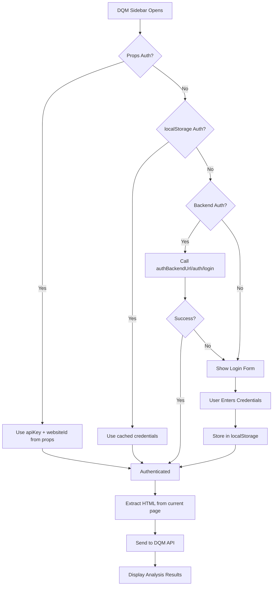
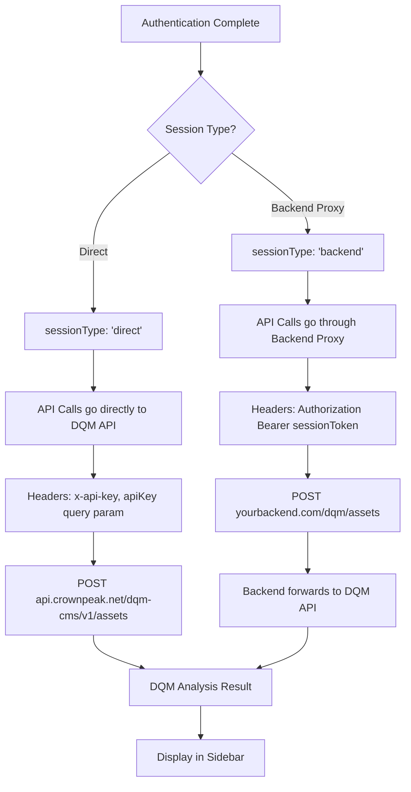

This document explains different ways to configure authentication for the DQM Sidebar component.

## Authentication Flow Overview



## Session Type Flow



## Authentication Methods

### 1. Direct Credentials (Simplest)

Pass API credentials directly as props:

```tsx
import { DQMSidebar } from '@crownpeak/dqm-react-component';

function App() {
  const [open, setOpen] = useState(false);

  return (
    <DQMSidebar
      open={open}
      onClose={() => setOpen(false)}
      onOpen={() => setOpen(true)}
      config={{
        apiKey: process.env.REACT_APP_DQM_API_KEY,
        websiteId: process.env.REACT_APP_DQM_WEBSITE_ID,
      }}
    />
  );
}
```

**Use Case:** Development, testing, demos

---

### 2. LocalStorage (Default Behavior)

If no credentials are provided via props, the component will check `localStorage` and show a login form if credentials are missing:

```tsx
import { DQMSidebar } from '@crownpeak/dqm-react-component';

function App() {
  const [open, setOpen] = useState(false);

  // On first open, user will see login form
  // Credentials are stored in localStorage after successful login
  return (
    <DQMSidebar
      open={open}
      onClose={() => setOpen(false)}
      onOpen={() => setOpen(true)}
      config={{
        useLocalStorage: true, // Default: true
      }}
    />
  );
}
```

**Use Case:** Simple deployments where users manage their own credentials

---

### 3. Backend Authentication (Recommended for Production)

Use your own Express.js backend to manage credentials securely:

```tsx
import { DQMSidebar } from '@crownpeak/dqm-react-component';

function App() {
  const [open, setOpen] = useState(false);

  return (
    <DQMSidebar
      open={open}
      onClose={() => setOpen(false)}
      onOpen={() => setOpen(true)}
      config={{
        authBackendUrl: 'https://api.yourcompany.com',
        useLocalStorage: true, // Cache session token
      }}
      onAuthSuccess={(credentials) => {
        console.log('Authenticated:', credentials.sessionType); // 'backend'
      }}
      onAuthError={(error) => {
        console.error('Auth failed:', error);
      }}
    />
  );
}
```

**Use Case:** Production deployments, centralized credential management

#### Backend API Requirements

Your backend must implement these endpoints:

```typescript
// POST /auth/login
// Body: { apiKey: string, websiteId: string }
// Response: { sessionToken: string, websiteId: string }

// POST /auth/logout
// Headers: Authorization: Bearer <sessionToken>
// Response: { success: true }

// GET /auth/session
// Headers: Authorization: Bearer <sessionToken>
// Response: { valid: true, websiteId: string }
```

See [Backend API Guide](./BACKEND-API.md) for complete implementation details.

---

### 4. Hybrid Configuration

Combine multiple authentication methods with priority:

```tsx
import { DQMSidebar } from '@crownpeak/dqm-react-component';

function App() {
  const [open, setOpen] = useState(false);

  return (
    <DQMSidebar
      open={open}
      onClose={() => setOpen(false)}
      onOpen={() => setOpen(true)}
      config={{
        // Priority 1: Direct credentials (if provided)
        apiKey: process.env.REACT_APP_DQM_API_KEY,
        websiteId: process.env.REACT_APP_DQM_WEBSITE_ID,
        
        // Priority 2: LocalStorage (if no props provided)
        useLocalStorage: true,
        
        // Priority 3: Backend authentication (fallback)
        authBackendUrl: 'https://api.yourcompany.com',
      }}
      onAuthSuccess={(credentials) => {
        console.log('Session type:', credentials.sessionType);
      }}
    />
  );
}
```

---

## Express.js Backend Example

Here's a complete Express.js backend example:

```typescript
import express from 'express';
import crypto from 'crypto';

const app = express();
app.use(express.json());

// In-memory session store (use Redis in production)
const sessions = new Map();

// POST /auth/login - Create session
app.post('/auth/login', async (req, res) => {
  const { apiKey, websiteId } = req.body;
  
  if (!apiKey || !websiteId) {
    return res.status(400).json({
      error: true,
      message: 'Missing required fields: apiKey, websiteId'
    });
  }
  
  // Create session token
  const sessionToken = crypto.randomBytes(32).toString('hex');
  sessions.set(sessionToken, {
    apiKey,
    websiteId,
    expiresAt: Date.now() + 24 * 60 * 60 * 1000 // 24 hours
  });
  
  res.json({ sessionToken, websiteId });
});

// POST /auth/logout - Invalidate session
app.post('/auth/logout', (req, res) => {
  const token = req.headers.authorization?.replace('Bearer ', '');
  sessions.delete(token);
  res.json({ success: true });
});

// GET /auth/session - Get session info
app.get('/auth/session', (req, res) => {
  const token = req.headers.authorization?.replace('Bearer ', '');
  const session = sessions.get(token);
  
  if (!session || session.expiresAt < Date.now()) {
    return res.status(401).json({ valid: false });
  }
  
  res.json({
    valid: true,
    websiteId: session.websiteId,
    sessionType: 'backend'
  });
});

app.listen(3001);
```

---

## Security Best Practices

1. **Never expose API keys in client-side code** for production
2. **Use HTTPS** for all authentication endpoints
3. **Implement rate limiting** on authentication endpoints
4. **Use short-lived sessions** (default: 24 hours)
5. **Log authentication events** for security monitoring
6. **Use Redis** for session storage in production (supports clustering)

---

## TypeScript Support

All configuration options are fully typed:

```tsx
import type { DQMConfig } from '@crownpeak/dqm-react-component';

const config: DQMConfig = {
  apiKey: '...',
  websiteId: '...',
  authBackendUrl: '...',
  useLocalStorage: true,
  apiEndpoint: 'https://api.crownpeak.net/dqm-cms/v1', // Optional: custom endpoint
};
```

---

## See Also

- [Backend API Guide](./BACKEND-API.md) - Complete backend implementation
- [Server Documentation](./SERVER.md) - Built-in Express server
- [API Reference](./API-REFERENCE.md) - Full TypeScript API
- [Examples](./EXAMPLES.md) - Integration examples
