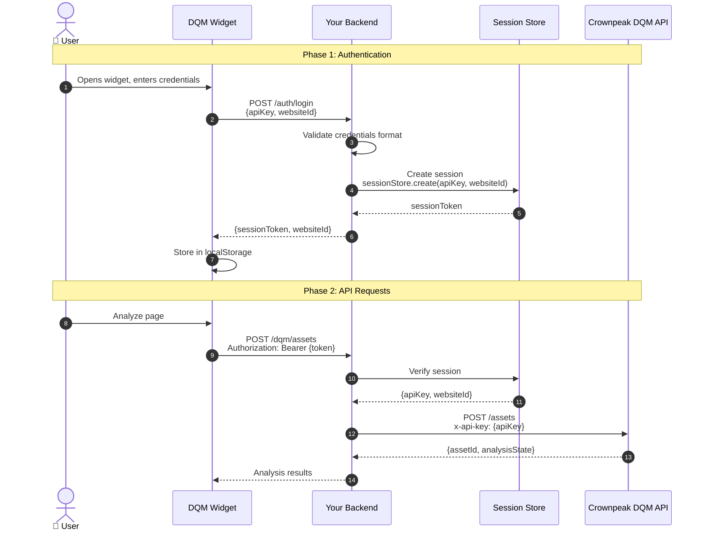

## Overview

The DQM Backend API provides a **secure proxy layer** between your React application and the Crownpeak DQM API. It enables **centralized credential management** through server-side storage, eliminating the need to expose DQM API keys in the browser.

## Two Operating Modes

### Mode 1: Direct API Key (Development/Testing)
User provides Crownpeak credentials directly in the widget:
```
User → Widget (API Key + Website ID) → Crownpeak DQM API
```
**Use Case:** Quick testing, development environments, demos

### Mode 2: Backend Session (Production - RECOMMENDED)
User authenticates with your backend, which manages DQM credentials:
```
User → Your Backend (Login) → Session Token → Widget → Backend Proxy → Crownpeak DQM API
```
**Use Case:** Production deployments, centralized credential management, enterprise environments

---

## Backend Architecture

### Authentication Flow



---

## API Endpoints

### Authentication Routes

#### POST /auth/login
Login with DQM credentials and receive a session token.

**Request:**
```json
{
  "apiKey": "your-dqm-api-key",
  "websiteId": "your-website-id"
}
```

**Response:**
```json
{
  "sessionToken": "abc123...",
  "websiteId": "your-website-id"
}
```

**Error Response:**
```json
{
  "error": true,
  "message": "Missing required fields: apiKey, websiteId"
}
```

---

#### POST /auth/logout
Invalidate the current session.

**Headers:**
```
Authorization: Bearer <sessionToken>
```

**Response:**
```json
{
  "success": true,
  "message": "Logged out successfully"
}
```

---

#### GET /auth/session
Get current session information.

**Headers:**
```
Authorization: Bearer <sessionToken>
```

**Response:**
```json
{
  "valid": true,
  "websiteId": "your-website-id",
  "sessionType": "backend"
}
```

---

#### POST /auth/token/validate
Validate if a session token is still valid.

**Request:**
```json
{
  "sessionToken": "abc123..."
}
```

**Response:**
```json
{
  "valid": true,
  "websiteId": "your-website-id"
}
```

---

### DQM Proxy Routes

All DQM routes require authentication via `Authorization: Bearer <sessionToken>` header.

#### POST /dqm/assets
Create a new analysis asset.

**Request:**
```json
{
  "html": "<html>...</html>",
  "url": "https://example.com/page"
}
```

**Response:**
```json
{
  "assetId": "asset-123",
  "analysisState": "analyzing"
}
```

---

#### GET /dqm/assets/:assetId/status
Get analysis status and results.

**Response:**
```json
{
  "assetId": "asset-123",
  "analysisState": "completed",
  "checkpoints": [...],
  "totalErrors": 5
}
```

---

#### GET /dqm/assets/:assetId/pagehighlight/all
Get HTML with all error highlights.

**Response:**
```json
{
  "html": "<html>...highlighted content...</html>"
}
```

---

#### GET /dqm/assets/:assetId/pagehighlight/:checkpointId
Get HTML with specific checkpoint highlighted.

**Response:**
```json
{
  "html": "<html>...highlighted content...</html>"
}
```

---

## Implementation

### Using the Built-in Server

The package includes a ready-to-use Express server:

```bash
# Start with in-memory sessions (development)
node node_modules/@crownpeak/dqm-react-component/dist/server/index.js

# Start with Redis (production)
REDIS_URL=redis://localhost:6379 \
PORT=3001 \
node node_modules/@crownpeak/dqm-react-component/dist/server/index.js
```

### Custom Implementation

If you need to integrate with your existing backend:

```typescript
import express from 'express';
import axios from 'axios';

const app = express();
app.use(express.json());

// In-memory session store (use Redis in production)
const sessions = new Map();

// POST /auth/login - Create session
app.post('/auth/login', async (req, res) => {
  const { apiKey, websiteId } = req.body;
  
  if (!apiKey || !websiteId) {
    return res.status(400).json({
      error: true,
      message: 'Missing required fields: apiKey, websiteId'
    });
  }
  
  // Validate API key encoding
  if (!/^[\x00-\x7F]*$/.test(apiKey)) {
    return res.status(400).json({
      error: true,
      message: 'API key contains non-ASCII characters'
    });
  }
  
  // Create session
  const sessionToken = generateUniqueToken();
  sessions.set(sessionToken, {
    apiKey,
    websiteId,
    expiresAt: Date.now() + 24 * 60 * 60 * 1000 // 24 hours
  });
  
  res.json({ sessionToken, websiteId });
});

// POST /auth/logout - Destroy session
app.post('/auth/logout', authenticateSession, (req, res) => {
  const token = req.headers.authorization?.replace('Bearer ', '');
  sessions.delete(token);
  res.json({ success: true, message: 'Logged out successfully' });
});

// GET /auth/session - Get session info
app.get('/auth/session', authenticateSession, (req, res) => {
  res.json({
    valid: true,
    websiteId: req.session.websiteId,
    sessionType: 'backend'
  });
});

// POST /dqm/assets - Proxy to DQM API
app.post('/dqm/assets', authenticateSession, async (req, res) => {
  const { apiKey, websiteId } = req.session;
  
  try {
    const response = await axios.post(
      'https://api.crownpeak.net/dqm-cms/v1/assets',
      req.body,
      {
        headers: { 'x-api-key': apiKey },
        params: { apiKey, websiteId }
      }
    );
    res.json(response.data);
  } catch (error) {
    res.status(error.response?.status || 500).json({
      error: true,
      message: error.message
    });
  }
});

// GET /dqm/assets/:assetId/status - Proxy status check
app.get('/dqm/assets/:assetId/status', authenticateSession, async (req, res) => {
  const { apiKey, websiteId } = req.session;
  
  try {
    const response = await axios.get(
      `https://api.crownpeak.net/dqm-cms/v1/assets/${req.params.assetId}`,
      {
        headers: { 'x-api-key': apiKey },
        params: { apiKey, websiteId }
      }
    );
    res.json(response.data);
  } catch (error) {
    res.status(error.response?.status || 500).json({
      error: true,
      message: error.message
    });
  }
});

// Middleware: Verify session token
function authenticateSession(req, res, next) {
  const token = req.headers.authorization?.replace('Bearer ', '');
  const session = sessions.get(token);
  
  if (!session || session.expiresAt < Date.now()) {
    return res.status(401).json({
      error: true,
      message: 'Invalid or expired session'
    });
  }
  
  req.session = session;
  next();
}

function generateUniqueToken() {
  return require('crypto').randomBytes(32).toString('hex');
}

app.listen(3001);
```

---

## Frontend Configuration

```tsx
import { DQMSidebar } from '@crownpeak/dqm-react-component';

function App() {
  const [open, setOpen] = useState(false);
  
  return (
    <DQMSidebar
      open={open}
      onOpen={() => setOpen(true)}
      onClose={() => setOpen(false)}
      config={{
        authBackendUrl: 'https://your-backend.com', // Backend proxy URL
        useLocalStorage: true, // Store session token
      }}
      onAuthSuccess={(creds) => {
        console.log('Authenticated:', creds.sessionType); // 'backend'
      }}
    />
  );
}
```

---

## Environment Variables

| Variable | Default | Description |
|----------|---------|-------------|
| `PORT` | `3001` | Server port |
| `REDIS_URL` | - | Redis connection URL (falls back to in-memory) |
| `CORS_ORIGINS` | `*` | Comma-separated list of allowed origins |
| `DQM_API_BASE_URL` | `https://api.crownpeak.net/dqm-cms/v1` | DQM API base URL |

---

## Security Considerations

### API Key Protection
- **Never expose** DQM API keys in frontend code
- Store keys **server-side only**
- Use HTTPS for all communications

### Session Management
- Session tokens should be **cryptographically random**
- Implement **session expiration** (default: 24 hours)
- Use **Redis** for production (supports clustering, persistence)

### CORS Configuration
- In production, specify **exact origins** instead of `*`
- Example: `CORS_ORIGINS=https://yourdomain.com,https://www.yourdomain.com`

---

## Testing

### Test Login

```bash
curl -X POST http://localhost:3001/auth/login \
  -H "Content-Type: application/json" \
  -d '{"apiKey":"your-api-key","websiteId":"your-website-id"}'
```

### Test Session

```bash
curl http://localhost:3001/auth/session \
  -H "Authorization: Bearer <session_token>"
```

### Test Analysis

```bash
curl -X POST http://localhost:3001/dqm/assets \
  -H "Authorization: Bearer <session_token>" \
  -H "Content-Type: application/json" \
  -d '{"html":"<html><body>Test</body></html>","url":"https://example.com"}'
```

---

## Migration from Direct Mode

1. **Set up backend** using the built-in server or custom implementation
2. **Update React config:**
   ```tsx
   // Before (Direct Mode)
   config={{
     apiKey: 'user_api_key',
     websiteId: 'user_website_id',
   }}
   
   // After (Backend Mode)
   config={{
     authBackendUrl: 'https://your-backend.com',
   }}
   ```
3. **Clear old localStorage** (optional):
   ```javascript
   localStorage.removeItem('dqm_apiKey');
   localStorage.removeItem('dqm_websiteID');
   ```

---

## See Also

- [Server Documentation](./SERVER.md) - Detailed server setup
- [Redis Setup](./REDIS-SETUP.md) - Production Redis configuration
- [Authentication Guide](./AUTHENTICATION.md) - Authentication modes
- [API Reference](./API-REFERENCE.md) - Full TypeScript API
