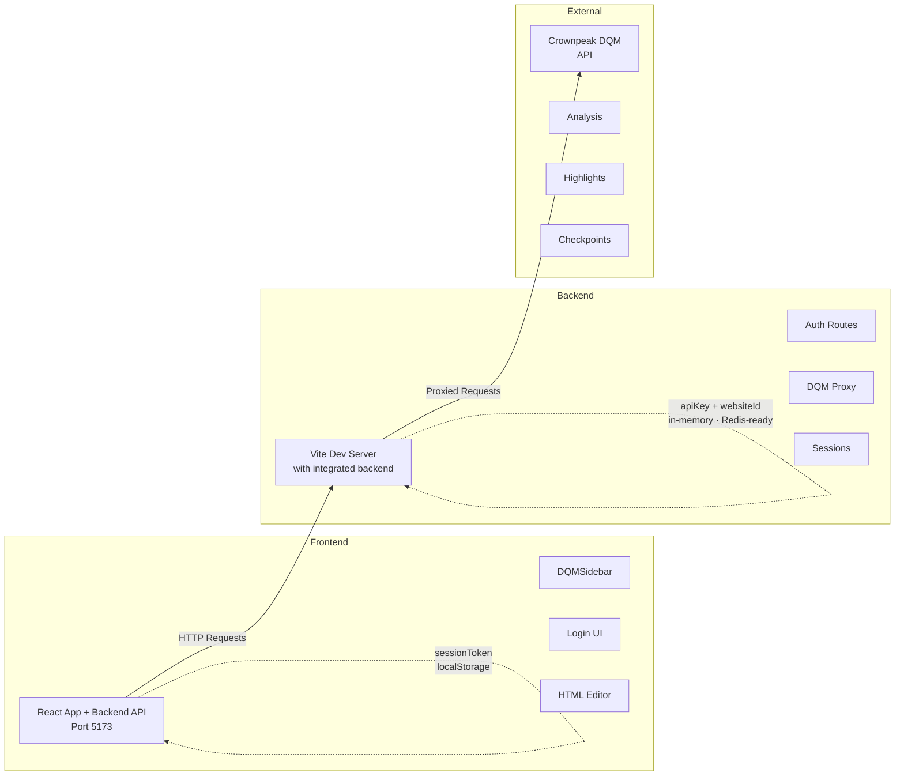

## Installation

```bash
npm install
```

## Build

```bash
npm run build
```

### Build widget only (for standalone script usage)

```bash
npm run build:widget
npm run serve:widget   # preview demos at http://localhost:4173/test/demo-iife.html etc.
```

## Start Development

```bash
npm run dev        # Vite dev server with integrated backend (port 5173)
npm run dev:server # Standalone Express server with Redis (port 3001)
```

This starts:
- ✅ **Frontend + Backend**: http://localhost:5173 (Vite Dev Server with integrated backend API)
- Backend routes (`/auth/*`, `/dqm/*`) are handled by Vite plugin

## Test the Integration

### 1. Open Frontend
Navigate to http://localhost:5173

### 2. Configure Backend Mode
The test harness is already configured to use the backend:

```tsx
config={{
  authBackendUrl: '', // Empty = same origin (backend integrated in Vite dev server)
  useLocalStorage: true,
}}
```

### 3. Login with Credentials
- Enter your Crownpeak DQM API Key
- Enter your Website ID
- Click "Continue"

The backend will:
1. Validate credentials with Crownpeak DQM API
2. Issue a session token
3. Store token in localStorage

### 4. Analyze HTML
- Paste HTML in the editor
- Click "Start Analysis"
- All requests go through `/dqm/*` on the same origin (port 5173 in dev)

## Architecture



## Two Authentication Modes

### Backend Mode (Recommended)
```tsx
config={{
  authBackendUrl: '', // Dev: empty (same origin) | Prod: 'https://your-backend.com'
}}
```
- ✅ Secure session tokens
- ✅ API keys remain server-side
- ✅ Centralized access control

### Direct Mode (Development)
```tsx
config={{
  apiKey: 'YOUR_API_KEY',
  websiteId: 'YOUR_WEBSITE_ID',
}}
```
- ✅ No backend required
- ✅ Quick testing
- ✅ Props or localStorage

## API Endpoints

### Authentication
- `POST /auth/login` - Login with credentials
- `POST /auth/logout` - Invalidate session
- `GET /auth/session` - Get session info

### DQM Proxy
- `POST /dqm/assets` - Start analysis
- `GET /dqm/assets/:id` - Get results
- `GET /dqm/assets/:id/pagehighlight/all` - All highlights
- `GET /dqm/assets/:id/pagehighlight/:cpId` - Single highlight

All DQM endpoints require `Authorization: Bearer <sessionToken>`

## Scripts

```bash
# Development
npm run dev              # Vite dev server with integrated backend (port 5173)
npm run dev:client       # Same as npm run dev
npm run dev:server       # Standalone Express server with Redis (port 3001)

# Build
npm run build            # Build all
npm run build:lib        # Build React library
npm run build:server     # Build Express server

# Production
npm run start:server     # Run built server
```

## Environment Setup

Copy `.env.example` to `.env`:

```env
PORT=3001
CORS_ORIGINS=http://localhost:5173
DQM_API_BASE_URL=https://api.crownpeak.net/dqm-cms/v1
JWT_SECRET=your-secret-key
```

## Documentation

- **[BACKEND-API.md](./BACKEND-API.md)** - Backend API specification
- **[DEVELOPMENT.md](./DEVELOPMENT.md)** - Development guide
- **[server/README.md](./server/README.md)** - Server documentation
- **[AUTHENTICATION.md](./AUTHENTICATION.md)** - Auth flow details
- **[EXAMPLES.md](./EXAMPLES.md)** - Integration examples

## Testing

### Test Backend Health (Dev Mode - Port 5173)
```bash
curl http://localhost:5173/health
```

### Test Login (Dev Mode)
```bash
curl -X POST http://localhost:5173/auth/login \
  -H "Content-Type: application/json" \
  -d '{"apiKey":"YOUR_KEY","websiteId":"YOUR_ID"}'
```

### Test Analysis (Dev Mode)
```bash
curl -X POST http://localhost:5173/dqm/assets \
  -H "Authorization: Bearer YOUR_TOKEN" \
  -H "Content-Type: application/json" \
  -d '{"html":"<html><body>Test</body></html>"}'
```

## Features

✅ **Modular Backend** - Express.js with clean architecture  
✅ **Session Management** - In-memory store (Redis-ready)  
✅ **DQM API Proxy** - All analysis endpoints  
✅ **CORS & Security** - Helmet.js, CORS whitelist  
✅ **Auto-reload** - TSX watch mode for development  
✅ **Concurrent Servers** - Frontend + Backend in one command  
✅ **TypeScript** - Full type safety  
✅ **Error Handling** - Centralized middleware  

## License

MIT
