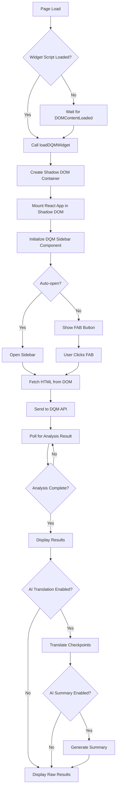

# Widget Bundle Guide

This guide covers using the DQM React Component as a standalone widget via the pre-built IIFE or ESM bundles. This allows you to use DQM without a build pipeline or React setup.

## Table of Contents
- [Overview](#overview)
- [Bundle Types](#bundle-types)
- [IIFE Bundle (Browser Global)](#iife-bundle-browser-global)
- [ESM Bundle (ES Modules)](#esm-bundle-es-modules)
- [Widget Loading Flow](#widget-loading-flow)
- [Integration Examples](#integration-examples)
- [CMS Integrations](#cms-integrations)
- [Configuration](#configuration)
- [Troubleshooting](#troubleshooting)

## Overview

The widget bundle provides a standalone version of the DQM sidebar that can be embedded in any web page without React dependencies. The widget:

- **Runs in Shadow DOM** - Isolated from page styles and scripts
- **Zero Dependencies** - All dependencies bundled (React, MUI, etc.)
- **Self-Contained** - No build pipeline or npm required
- **CMS-Friendly** - Easy integration with WordPress, Shopify, Drupal, etc.

## Bundle Types

| Format | File | Use Case | Browser Support |
|--------|------|----------|----------------|
| **IIFE** | `dqm-widget.iife.js` | Traditional `<script>` tag | All browsers (IE11+) |
| **ESM** | `dqm-widget.esm.js` | `<script type="module">` | Modern browsers (ES2015+) |

Both bundles are located in `/dist/` after building:

```bash
npm run build:lib
ls -lh dist/dqm-widget.*
```

**Sizes:**
- IIFE: ~500KB minified (includes all dependencies)
- ESM: ~480KB minified (tree-shakeable)

## IIFE Bundle (Browser Global)

### Basic Usage

```html
<!DOCTYPE html>
<html lang="en">
<head>
    <meta charset="UTF-8">
    <title>DQM Widget - IIFE Example</title>
</head>
<body>
    <h1>My Website</h1>
    <p>Content to be analyzed by DQM</p>

    <!-- Include the IIFE bundle -->
    <script src="https://unpkg.com/@crownpeak/dqm-react-component/dist/dqm-widget.iife.js"></script>
    
    <script>
        // Load DQM Widget
        window.DQMWidget.loadDQMWidget({
            config: {
                websiteId: 'your-website-id',
                apiKey: 'your-api-key',
            }
        });
    </script>
</body>
</html>
```

### API

The IIFE bundle exposes a global `DQMWidget` object with:

```typescript
window.DQMWidget = {
    /**
     * Load and initialize the DQM widget
     * @param options - Widget configuration
     * @returns Cleanup function to remove widget
     */
    loadDQMWidget(options: {
        config: DQMConfig;
        containerId?: string;
        open?: boolean;
    }): () => void;

    /**
     * Get current widget version
     */
    version: string;
}
```

### Full Example with AI Features

```html
<!DOCTYPE html>
<html lang="en">
<head>
    <meta charset="UTF-8">
    <title>DQM Widget with AI Translation</title>
</head>
<body>
    <h1>Willkommen zu meiner Website</h1>
    <p>Diese Seite wird mit Crownpeak DQM überwacht.</p>

    <script src="https://unpkg.com/@crownpeak/dqm-react-component/dist/dqm-widget.iife.js"></script>
    
    <script>
        // Initialize widget with AI translation
        const cleanup = window.DQMWidget.loadDQMWidget({
            open: true, // Auto-open sidebar
            config: {
                websiteId: 'your-website-id',
                apiKey: 'your-dqm-api-key',
                
                // AI Translation
                translation: {
                    enabled: true,
                    backend: 'openai',
                    apiKey: 'sk-...',
                    model: 'gpt-4o-mini',
                    targetLanguage: 'de',
                    mode: 'fast',
                },
                
                // AI Summary
                summary: {
                    enabled: true,
                    backend: 'openai',
                    apiKey: 'sk-...',
                    model: 'gpt-4o-mini',
                }
            }
        });

        // Optional: Remove widget later
        // cleanup();
    </script>
</body>
</html>
```

## ESM Bundle (ES Modules)

### Basic Usage

```html
<!DOCTYPE html>
<html lang="en">
<head>
    <meta charset="UTF-8">
    <title>DQM Widget - ESM Example</title>
</head>
<body>
    <h1>My Website</h1>
    <p>Content to be analyzed by DQM</p>

    <script type="module">
        import { loadDQMWidget } from 'https://unpkg.com/@crownpeak/dqm-react-component/dist/dqm-widget.esm.js';

        loadDQMWidget({
            config: {
                websiteId: 'your-website-id',
                apiKey: 'your-api-key',
            }
        });
    </script>
</body>
</html>
```

### With Import Maps

```html
<!DOCTYPE html>
<html lang="en">
<head>
    <meta charset="UTF-8">
    <title>DQM Widget - ESM with Import Maps</title>
    
    <!-- Define import map for cleaner imports -->
    <script type="importmap">
    {
        "imports": {
            "dqm-widget": "https://unpkg.com/@crownpeak/dqm-react-component/dist/dqm-widget.esm.js"
        }
    }
    </script>
</head>
<body>
    <h1>My Website</h1>

    <script type="module">
        import { loadDQMWidget } from 'dqm-widget';

        loadDQMWidget({
            config: {
                websiteId: 'your-website-id',
                apiKey: 'your-api-key',
            }
        });
    </script>
</body>
</html>
```

## Widget Loading Flow



## Integration Examples

### WordPress (PHP Template)

```php
<?php
/**
 * Template Name: DQM Monitored Page
 */
get_header();
?>

<main id="primary" class="site-main">
    <?php
    while ( have_posts() ) :
        the_post();
        the_content();
    endwhile;
    ?>
</main>

<!-- DQM Widget -->
<script src="https://unpkg.com/@crownpeak/dqm-react-component/dist/dqm-widget.iife.js"></script>
<script>
    window.DQMWidget.loadDQMWidget({
        config: {
            websiteId: '<?php echo esc_js( get_option('dqm_website_id') ); ?>',
            apiKey: '<?php echo esc_js( get_option('dqm_api_key') ); ?>',
        }
    });
</script>

<?php get_footer(); ?>
```

### Shopify (Liquid Template)

```liquid
<!-- layout/theme.liquid -->
<!DOCTYPE html>
<html lang="{{ request.locale.iso_code }}">
<head>
    <meta charset="utf-8">
    <title>{{ page_title }}</title>
    {{ content_for_header }}
</head>
<body>
    {{ content_for_layout }}

    <!-- DQM Widget -->
    <script src="https://unpkg.com/@crownpeak/dqm-react-component/dist/dqm-widget.iife.js"></script>
    <script>
        window.DQMWidget.loadDQMWidget({
            config: {
                websiteId: '{{ settings.dqm_website_id }}',
                apiKey: '{{ settings.dqm_api_key }}',
            }
        });
    </script>
</body>
</html>
```

### Drupal (Twig Template)

```twig
{# page.html.twig #}
<div class="layout-container">
    <header role="banner">
        {{ page.header }}
    </header>

    <main role="main">
        {{ page.content }}
    </main>

    <footer role="contentinfo">
        {{ page.footer }}
    </footer>
</div>

{# DQM Widget #}
<script src="https://unpkg.com/@crownpeak/dqm-react-component/dist/dqm-widget.iife.js"></script>
<script>
    window.DQMWidget.loadDQMWidget({
        config: {
            websiteId: '{{ drupal_variable('dqm_website_id') }}',
            apiKey: '{{ drupal_variable('dqm_api_key') }}',
        }
    });
</script>
```

### Webflow (Custom Code)

```html
<!-- Embed in Page Settings > Custom Code > Before </body> tag -->
<script src="https://unpkg.com/@crownpeak/dqm-react-component/dist/dqm-widget.iife.js"></script>
<script>
    window.DQMWidget.loadDQMWidget({
        config: {
            websiteId: 'your-website-id',
            apiKey: 'your-api-key',
        }
    });
</script>
```

### Google Tag Manager

```javascript
// Create new Custom HTML tag
<script src="https://unpkg.com/@crownpeak/dqm-react-component/dist/dqm-widget.iife.js"></script>
<script>
    window.DQMWidget.loadDQMWidget({
        config: {
            websiteId: '{{DQM Website ID}}', // GTM Variable
            apiKey: '{{DQM API Key}}',       // GTM Variable
        }
    });
</script>

// Trigger: All Pages (or specific pages)
```

## CMS Integrations

### WordPress Plugin Structure

```
dqm-widget-wordpress/
├── dqm-widget.php                  # Main plugin file
├── admin/
│   └── settings.php                # Admin settings page
└── public/
    └── widget-loader.php           # Frontend widget loader
```

**dqm-widget.php:**
```php
<?php
/**
 * Plugin Name: Crownpeak DQM Widget
 * Description: Adds Crownpeak Digital Quality Management to your WordPress site
 * Version: 1.1.0
 * Author: Crownpeak
 */

// Admin settings
require_once plugin_dir_path(__FILE__) . 'admin/settings.php';

// Frontend loader
require_once plugin_dir_path(__FILE__) . 'public/widget-loader.php';

function dqm_enqueue_widget() {
    if (!is_admin()) {
        wp_enqueue_script(
            'dqm-widget',
            'https://unpkg.com/@crownpeak/dqm-react-component/dist/dqm-widget.iife.js',
            array(),
            '1.1.0',
            true
        );

        wp_add_inline_script('dqm-widget', sprintf(
            'window.DQMWidget.loadDQMWidget({config:{websiteId:"%s",apiKey:"%s"}});',
            esc_js(get_option('dqm_website_id')),
            esc_js(get_option('dqm_api_key'))
        ));
    }
}
add_action('wp_enqueue_scripts', 'dqm_enqueue_widget');
```

### Shopify App Structure

```
dqm-widget-shopify/
├── app.js                          # Node.js server
├── package.json
├── extensions/
│   └── theme-app-extension/
│       ├── blocks/
│       │   └── dqm-widget.liquid
│       └── locales/
│           └── en.default.json
```

**blocks/dqm-widget.liquid:**
```liquid

{
  "name": "DQM Widget",
  "target": "section",
  "settings": [
    {
      "type": "text",
      "id": "website_id",
      "label": "DQM Website ID"
    },
    {
      "type": "text",
      "id": "api_key",
      "label": "DQM API Key"
    }
  ]
}


<script src="https://unpkg.com/@crownpeak/dqm-react-component/dist/dqm-widget.iife.js"></script>
<script>
    window.DQMWidget.loadDQMWidget({
        config: {
            websiteId: '{{ block.settings.website_id }}',
            apiKey: '{{ block.settings.api_key }}',
        }
    });
</script>
```

## Configuration

### Full Configuration Object

```typescript
interface DQMConfig {
    // Authentication (required)
    websiteId: string;
    apiKey: string;

    // Overlay Detection (optional)
    overlayConfig?: {
        selector?: string;
        validateIframe?: boolean;
        pollMs?: number;
        manualOffset?: {
            position: 'top' | 'bottom' | 'left' | 'right';
            pixels: number;
        };
    };

    // AI Translation (optional)
    translation?: {
        enabled: boolean;
        backend: 'openai' | 'webllm';
        apiKey?: string;            // Required for OpenAI
        model?: string;             // e.g., 'gpt-4o-mini', 'Llama-3.2-1B-Instruct-q4f16_1-MLC'
        targetLanguage?: string;    // ISO 639-1 code (e.g., 'de', 'es', 'fr')
        mode?: 'fast' | 'full';     // fast: 15s timeout, full: 120s timeout
    };

    // AI Summary (optional)
    summary?: {
        enabled: boolean;
        backend: 'openai';          // Only OpenAI supported
        apiKey?: string;
        model?: string;             // e.g., 'gpt-4o-mini', 'gpt-4o'
    };
}
```

### Environment-Specific Configuration

```javascript
// Development
window.DQMWidget.loadDQMWidget({
    config: {
        websiteId: 'dev-website-id',
        apiKey: 'dev-api-key',
        translation: {
            enabled: true,
            backend: 'webllm', // Use local inference in dev
            model: 'Llama-3.2-1B-Instruct-q4f16_1-MLC',
            targetLanguage: 'de',
            mode: 'full',
        }
    }
});

// Production
window.DQMWidget.loadDQMWidget({
    config: {
        websiteId: 'prod-website-id',
        apiKey: 'prod-api-key',
        translation: {
            enabled: true,
            backend: 'openai', // Use OpenAI in prod for speed
            apiKey: 'sk-...',
            model: 'gpt-4o-mini',
            targetLanguage: 'de',
            mode: 'fast',
        },
        summary: {
            enabled: true,
            backend: 'openai',
            apiKey: 'sk-...',
            model: 'gpt-4o-mini',
        }
    }
});
```

## Troubleshooting

### Widget Not Loading

**Symptom:** Nothing appears on the page after script inclusion.

**Solutions:**
1. Check browser console for errors
2. Verify script URL is correct and accessible
3. Ensure script is loaded after `<body>` tag
4. Check if Content Security Policy (CSP) blocks script

```html
<!-- Add to <head> if CSP is blocking -->
<meta http-equiv="Content-Security-Policy" content="script-src 'self' https://unpkg.com;">
```

### Shadow DOM Conflicts

**Symptom:** Widget styles broken or invisible.

**Solutions:**
1. Ensure no global CSS resets affect Shadow DOM
2. Check if page uses `::slotted()` selectors that interfere
3. Verify no JavaScript tries to access widget internals

```javascript
// DON'T: Access Shadow DOM internals
const widgetHost = document.querySelector('#dqm-widget-host');
const shadowRoot = widgetHost.shadowRoot; // May be null or closed

// DO: Use widget API only
window.DQMWidget.loadDQMWidget({ /* config */ });
```

### CORS Errors

**Symptom:** `Access-Control-Allow-Origin` errors in console.

**Solutions:**
1. Use CDN URL (unpkg.com) instead of local file
2. Host bundle on same domain as page
3. Configure server CORS headers if self-hosting

```nginx
# nginx configuration for self-hosting
location /dqm-widget.iife.js {
    add_header Access-Control-Allow-Origin *;
    add_header Access-Control-Allow-Methods "GET, OPTIONS";
}
```

### Performance Issues

**Symptom:** Widget loads slowly or blocks page rendering.

**Solutions:**
1. Load script with `defer` or `async` attribute
2. Use ESM bundle for better tree-shaking
3. Consider lazy-loading widget on user interaction

```html
<!-- Defer script loading -->
<script defer src="https://unpkg.com/@crownpeak/dqm-react-component/dist/dqm-widget.iife.js"></script>

<!-- Or load on user click -->
<button id="load-dqm">Analyze Page Quality</button>
<script>
    document.getElementById('load-dqm').addEventListener('click', () => {
        const script = document.createElement('script');
        script.src = 'https://unpkg.com/@crownpeak/dqm-react-component/dist/dqm-widget.iife.js';
        script.onload = () => {
            window.DQMWidget.loadDQMWidget({ config: { /* ... */ } });
        };
        document.body.appendChild(script);
    });
</script>
```

### AI Features Not Working

**Symptom:** Translation or summary not appearing.

**Solutions:**
1. Check OpenAI API key is valid (if using OpenAI backend)
2. Verify WebGPU support (if using WebLLM backend)
3. Check browser console for AI-related errors
4. Ensure localStorage keys are set correctly

```javascript
// Debug AI configuration
console.log('Translation Enabled:', localStorage.getItem('dqm_translate_results_enabled'));
console.log('AI Backend:', localStorage.getItem('dqm_ai_backend'));
console.log('Target Language:', localStorage.getItem('dqm_target_language'));
console.log('Summary Enabled:', localStorage.getItem('dqm_ai_summary_enabled'));
```

## See Also

- **[Examples](./EXAMPLES.md)** - React component examples
- **[AI Features Guide](./AI-FEATURES.md)** - AI translation and summary documentation
- **[Troubleshooting](./TROUBLESHOOTING.md)** - Common issues and solutions
- **[API Reference](./API-REFERENCE.md)** - Full TypeScript API documentation
